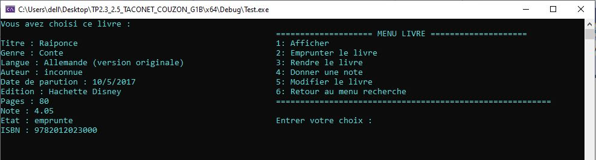

# Bibliotheque sur console :blue_book:

*Dans le cadre du module M1103 (Structures de données & Algorithmes fondamentaux), nous avons réalisé une bibliothèque sur console, il s'agit du premier projet lorsqu'on débutait le C et un peu de C++.* 

### Date de réalisation (2 mois) 
Novembre 2019 - 5 janvier 2020
  
### Enseignants encadrants 
- Stéphane MERILLOU
- Necer FAYCAL
- Denis DUPONT 

### Membres  
- Etienne COUZON
- Marie TACONET  

### Langages
- C
- C++

### Fonctionnalités
- Afficher la bibliothèque
- Ajouter un livre, un auteur  
- Modifier un livre, un auteur
- Supprimer un livre, un auteur
- Rechercher un livre
- Emprunter un livre
- Noter un livre 

